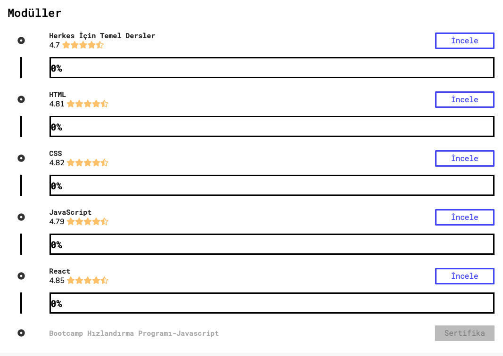
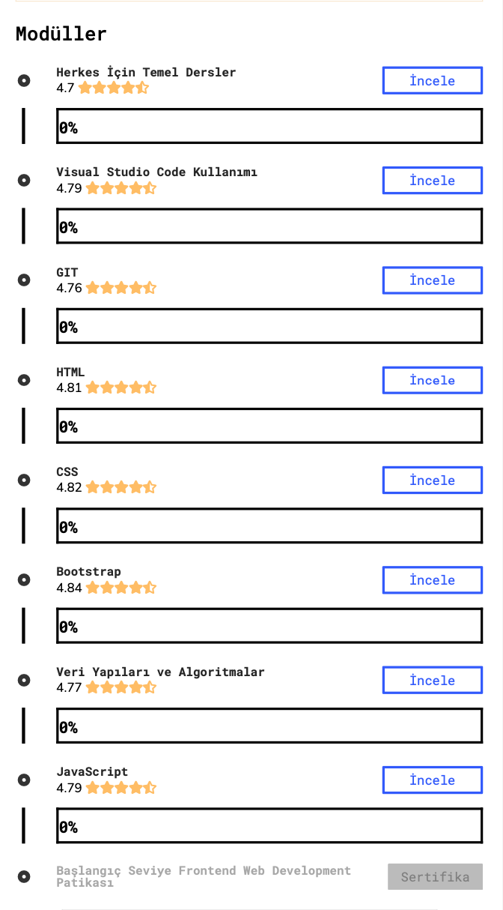

# Patika-FrontEnd-Paths
>Yunuscan Unal
>> [LinkedIn](http://linkedin.com/in/yunuscanunal/) - [Email](mailto:yunuscanunal1@gmail.com) - [Patika](https://app.patika.dev/yunuscanunal)

### About Repository
This repository is about a course at patika.dev. The subject of the course is **Front-End Web Development** and this repository is including homeworks and projects given about different topics such as html, css, javascript etc. in that course.
 

Also, this repository contains the homeworks and paths of the **Acceleration Program**, as I was invited to the [*Patika.dev*](patika.dev) **Bootcamp Acceleration Program** and followed the syllabus.

*Images of syllabus are in below.*

---

### About Programs

**Bootcamp Acceleration Program** is included following topics:
Link: [Bootcamp Acceleration Program](https://app.patika.dev/egitimler/bootcamp-hizlandirma-programi-javascript)
- [x] Basic Lectures
- [x] HTML
- [ ] CSS
- [x] JavaScript
- [ ] React

**Frontend Web Development Path for Beginners** is included following topics:
Link: [Frontend Web Development Path for Beginners](https://app.patika.dev/egitimler/baslangic-seviye-frontend-web-development-patikasi)
- [x] Basic Lectures
- [x] Visual Studio Code
- [x] GIT
- [x] HTML
- [ ] CSS
- [ ] Bootstrap
- [x] Data Structures and Algorithms
- [x] JavaScript

---

### Images 

##### Bootcamp Acceleration Program

##### Frontend Web Development Path for Beginners

##### Patika

